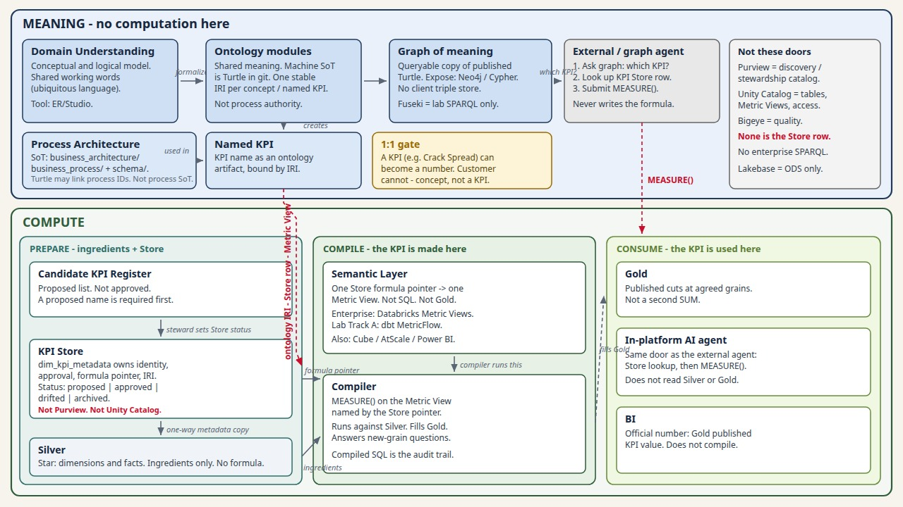

# Enterprise Performance Model Master Index
**Artifact ID:** EPM-FOUND-000
**Version:** 2.4 Draft
**Status:** Draft (functioning as working baseline)
**Owner:** Enterprise Performance Model Lead
**Steward / maintainer:** To be confirmed
**Last updated:** 2026-08-29
**Canonical path:** `EPM-FOUND-000.md`

*Repository home, architecture map, artifact register, decisions, issues, and delivery control*

> **This is the canonical Master Index.** Other files that reuse ID EPM-FOUND-000 are stubs, pack-local maps, or superseded reading copies. See [README.md](README.md).

**Foundation navigation:** [EPM-FOUND-000](EPM-FOUND-000.md) | [EPM-FOUND-000A](EPM_Project_Enablement_Pack_Markdown_HTML/EPM-FOUND-000A_Architectural_Principles.md) | [EPM-FOUND-001](EPM_Foundation_v2_Markdown_HTML/EPM-FOUND-001.md) | [EPM-FOUND-002](EPM_Foundation_v2_Markdown_HTML/EPM-FOUND-002.md) | [EPM-FOUND-003](EPM_Foundation_v2_Markdown_HTML/EPM-FOUND-003.md) | [EPM-FOUND-004](EPM_Foundation_v2_Markdown_HTML/EPM-FOUND-004.md) | [EPM-FOUND-005](EPM_Foundation_v2_Markdown_HTML/EPM-FOUND-005.md) | [EPM-FOUND-006](EPM_Foundation_v2_Markdown_HTML/EPM-FOUND-006.md)

---

## What this document is

This Master Index does two jobs at once. As an **architecture map** it orients you to the whole Enterprise Performance Model and points to the foundation artifacts that define it. As a **control panel** it holds the project's live governance state — the artifact register, decisions, conflicts, open issues, the source-precedence rules, roles, and what happens next. The first job answers *"how does this all fit together?"*; the second answers *"where does the project actually stand?"*

The architecture content was adopted from the EPM Foundation v2 set. The control content was carried forward from the project's governance baseline so that adopting v2 did not quietly drop the machinery that makes this a *governed* effort.

> This Markdown file is the **maintenance source**. The self-contained HTML file is the reading copy. Edit here, then regenerate the HTML.

---

## Executive orientation

The **Enterprise Performance Model (EPM)** is the shared architecture that connects:

- how the downstream enterprise creates and delivers value;
- how business performance is observed, explained, and governed;
- how trusted data is organized into reusable products;
- how KPIs are defined, calculated, stored, and consumed; and
- how Power BI, APIs, automation, analytics, AI, and future agents use consistent business context.

The EPM is the conceptual umbrella. The KPI Store, ontology, knowledge graph, SQL consumption views, Power BI semantic models, reports, APIs, and AI agents are implementations or consumers of parts of that architecture.

**In plain language.** The Tableau-to-Power BI migration moved the pictures but not the meaning. Every report was rebuilt, but nobody recorded what each number means, who owns it, what good looks like, or where it comes from. This initiative builds the missing card catalogue — starting with the KPI Store.

> **Current program context.** Most in-scope Tableau reports have already been migrated to Power BI. During migration, KPI definitions, ownership, targets, thresholds, lineage, and standardization were not systematically captured. Tableau XML is now being parsed retrospectively to inventory calculations. Extracted calculations are historical evidence — not approved KPIs.

---

## Primary architecture chain

```text
Enterprise strategy and objectives
        ↓
Business domains
        ↓
Value streams and value-stream stages
        ↕ use
Capabilities and sub-capabilities
        ↓ realized through
Business processes
        ↓ decomposed into
Business activities
        ↓ support or produce
Business decisions
        ↓ observed through
Measurements and metrics
        ↓ governed as
KPIs and performance outcomes
        ↓ supplied by
Foundational and derived data products
        ↓ exposed through
KPI Store, semantic views, Power BI semantic models, APIs
        ↓ consumed by
Reports, analytics, automation, AI, and management processes
```

Read left to right it is a design sequence. Read right to left it is the audit question: take a number on a dashboard and trace it back until you reach a business goal someone owns. Wherever the trace breaks is the gap this project closes.

**One caution:** this is a set of *connected structures with a performance overlay*, not one strict parent-child hierarchy. KPIs are a governed overlay that can measure a value stream, stage, capability, process, or outcome — not a structural level beneath activities. Value streams and capabilities are modelled separately: a stage *uses* capabilities; it is not a list of them.

---

## Architecture families

| Architecture | Primary question | Core concepts | Canonical artifact |
|---|---|---|---|
| Principles (constitutional) | What rules govern every design choice? | The 16 architectural principles and exception process | EPM-FOUND-000A |
| Business architecture | How does the enterprise create and deliver value? | Domain, value stream, stage, capability, process, activity, decision | EPM-FOUND-001 |
| Performance architecture | How is performance observed, explained, and governed? | Measurement, metric, indicator, KPI, objective, target, threshold | EPM-FOUND-002 and EPM-FOUND-005 |
| Semantic architecture | What do the concepts mean and how are they related? | Definitions, relationships, rules, constraints, classifications | EPM-FOUND-003 |
| Ontology architecture | How is the semantic model formalized for machines? | Classes, properties, cardinality, inheritance, axioms | EPM-FOUND-004 |
| Data-product architecture | How is trusted data packaged and delivered? | Foundational product, derived product, KPI Store, semantic view | EPM-FOUND-006 |
| Consumption architecture | How do people and systems use governed meaning and data? | SQL views, Power BI models, APIs, reports, agents | EPM-FOUND-006 |
| Governance and project operation | Who owns meaning, and how is change controlled? | Ownership, precedence, lifecycle, migration, cadence | EPM-PROJ-001 to 006 and this index |

### Meaning vs compute (target band split)



Meaning (Turtle in git) does not compute. Compute prepares Silver ingredients, compiles once via `MEASURE()` on a Metric View, and publishes Gold. The only legal join is **one ontology IRI → one KPI Store row → one Metric View**. The Store owns identity, approval, status (`proposed | approved | drifted | archived` on `dim_kpi_metadata`), and the formula pointer. Purview and Unity Catalog discover and govern pointed-at assets; they are not the Store door. Process authority stays `business_architecture/business_process/` and `business_architecture/schema/` — the picture’s Process Architecture box is not Turtle SoT. Agents ask the graph of meaning which KPI, look up the Store row, and submit `MEASURE()` on the Metric View the formula pointer names.

Artifact note: [architecture/README.md](architecture/README.md). Enterprise serve path (no client triple store; Neo4j expose; Fuseki is lab-only): ADR-HL-021 in [EPM_Homelab/02-Tool-Selection-and-ADRs.md](EPM_Homelab/02-Tool-Selection-and-ADRs.md).

---

## Workstreams and current sequence

| Workstream | Purpose | Priority | Current emphasis |
|---|---|---|---|
| KPI Store and Enterprise Performance Management | Govern metrics and KPIs; persist approved values, targets, status, versions, and lineage | Immediate | Measurement classification, pilot KPIs, tall fact, threshold model |
| Domain Modeling | Formalize business concepts and conceptual/logical models | Follow-on and iterative | Reconnect KPIs and data products to domains, concepts, entities, and fields |
| System Integration | Connect metadata, models, catalog, quality, and consumption tooling | Follow-on | Targeted proofs of value and tool-responsibility boundaries |
| Cross-cutting Data Governance | Govern definitions, ownership, quality, lineage, security, certification, and lifecycle | Continuous | Promotion rules, stewardship, certification, issue resolution |

**Approved working sequence:**

1. Define the KPI Store and measurement architecture.
2. Inventory and classify Tableau calculations.
3. Establish KPI governance and implement pilot KPIs.
4. Formalize domain modeling and reconnect models to the KPI Store.
5. Define and prove system-integration patterns.
6. Scale, automate, and operationalize.

> **Note on scope (resolves C-07).** An earlier handoff proposed ten workstreams. The adopted build expresses the extra concerns — semantic model, ontology, and so on — as **architecture families and foundation artifacts**, while keeping **delivery workstreams at four**. Broaden the architecture; keep the delivery aperture narrow so the KPI Store is not delayed.

---

## Canonical foundation and project set

| ID | Title | Role | Status | Location |
|---|---|---|---|---|
| EPM-FOUND-000 | Enterprise Performance Model Master Index | Architecture map + control panel (this document) | Draft (2.4) | This file (canonical) |
| EPM-FOUND-000A | Architectural Principles | The 16 constitutional principles governing all design | Draft (working baseline) | [EPM_Project_Enablement_Pack_Markdown_HTML/EPM-FOUND-000A_Architectural_Principles.md](EPM_Project_Enablement_Pack_Markdown_HTML/EPM-FOUND-000A_Architectural_Principles.md) |
| EPM-FOUND-001 | Enterprise Business Architecture | Pattern document for domains, value streams, capabilities, processes, activities, decisions. Not the process instance SoT. | Draft (working baseline) | [EPM_Foundation_v2_Markdown_HTML/EPM-FOUND-001.md](EPM_Foundation_v2_Markdown_HTML/EPM-FOUND-001.md) |
| EPM-FOUND-002 | Enterprise Performance and Data Architecture | Objectives → measurements → metrics → KPIs → data products → KPI Store → consumption | Draft (working baseline) | [EPM_Foundation_v2_Markdown_HTML/EPM-FOUND-002.md](EPM_Foundation_v2_Markdown_HTML/EPM-FOUND-002.md) |
| EPM-FOUND-003 | Enterprise Performance Semantic Model | Human-readable semantic model. Not the machine SoT. | Draft (working baseline) | [EPM_Foundation_v2_Markdown_HTML/EPM-FOUND-003.md](EPM_Foundation_v2_Markdown_HTML/EPM-FOUND-003.md) |
| EPM-FOUND-004 | Enterprise Performance Ontology Design | Ontology design. Not the machine SoT. Machine expression is Turtle in git. | Draft (working baseline) | [EPM_Foundation_v2_Markdown_HTML/EPM-FOUND-004.md](EPM_Foundation_v2_Markdown_HTML/EPM-FOUND-004.md) |
| EPM-FOUND-005 | Enterprise Measurement and KPI Model | Classification and promotion model; Tableau extraction rules | Draft (working baseline) | [EPM_Foundation_v2_Markdown_HTML/EPM-FOUND-005.md](EPM_Foundation_v2_Markdown_HTML/EPM-FOUND-005.md) |
| EPM-FOUND-006 | Enterprise Data Product and Consumption Model | Foundational/derived products, medallion alignment, consumption | Draft (working baseline) | [EPM_Foundation_v2_Markdown_HTML/EPM-FOUND-006.md](EPM_Foundation_v2_Markdown_HTML/EPM-FOUND-006.md) |
| EPM-PROJ-001 | Project Instructions | Concise operating rules for the project | Draft (working baseline) | [EPM_Project_Enablement_Pack_Markdown_HTML/EPM-PROJ-001_Project_Instructions.md](EPM_Project_Enablement_Pack_Markdown_HTML/EPM-PROJ-001_Project_Instructions.md) |
| EPM-PROJ-002 | Project Operating Model | How chats, artifacts, decisions, reviews, and implementation work together | Draft (working baseline) | [EPM_Project_Enablement_Pack_Markdown_HTML/EPM-PROJ-002_Project_Operating_Model.md](EPM_Project_Enablement_Pack_Markdown_HTML/EPM-PROJ-002_Project_Operating_Model.md) |
| EPM-PROJ-003 | Project Onboarding Guide | How to establish the project and preserve prior work | Draft (working baseline) | [EPM_Project_Enablement_Pack_Markdown_HTML/EPM-PROJ-003_Project_Onboarding_Guide.md](EPM_Project_Enablement_Pack_Markdown_HTML/EPM-PROJ-003_Project_Onboarding_Guide.md) |
| EPM-PROJ-004 | Artifact and Chat Map | Question → artifact and question → chat routing | Draft (working baseline) | [EPM_Project_Enablement_Pack_Markdown_HTML/EPM-PROJ-004_Artifact_and_Chat_Map.md](EPM_Project_Enablement_Pack_Markdown_HTML/EPM-PROJ-004_Artifact_and_Chat_Map.md) |
| EPM-PROJ-005 | Migration Checklist | Controlled checklist for moving work into the project | Draft (working baseline) | [EPM_Project_Enablement_Pack_Markdown_HTML/EPM-PROJ-005_Migration_Checklist.md](EPM_Project_Enablement_Pack_Markdown_HTML/EPM-PROJ-005_Migration_Checklist.md) |
| EPM-PROJ-006 | Chat Migration Playbook and Templates | Routing matrix, closeout, migration procedure, control-log templates *(salvaged from the superseded Register)* | Draft (working baseline) | [EPM_Project_Enablement_Pack_Markdown_HTML/EPM-PROJ-006_Chat_Migration_Playbook_and_Templates.md](EPM_Project_Enablement_Pack_Markdown_HTML/EPM-PROJ-006_Chat_Migration_Playbook_and_Templates.md) |
| EPM-GLOS-001 | Business Glossary | Shared business meaning for terms | To be located | No reviewed source in repo |
| EPM-SRC-001 | Source and Traceability Register | Where every conclusion originated | Not started | Planned — no file yet |
| EPM-DEC-001 | Architecture Decision Log | Material decisions and their rationale | Not started | Planned — no file yet |
| EPM-ISS-001 | Open Issues and Assumptions Log | Open uncertainty and conflicts | Not started | Planned — no file yet |

### Superseded artifacts (retained for reference, not yet deleted)

| Former ID / file | Title | Location | Superseded by | Residual content to migrate before hard-retire |
|---|---|---|---|---|
| EPM-FOUND-001 (old) / `02_Project_Charter...` | Project Charter and Operating Model | [ARCHIVE/02_Project_Charter_and_Operating_Model.md](ARCHIVE/02_Project_Charter_and_Operating_Model.md) | PROJ-001, PROJ-002, FOUND-000A (principles), FOUND-000 (roles, sequence) | §3 Strategic Objectives; §4 detailed workstream scope/exclusions; §5.1–5.10 detailed role responsibilities; §8 eight-stage delivery lifecycle; §15 Definition of Success — logged as **C-11** |
| EPM-FOUND-002 (old) / `03_Canonical_Artifact_Register...` | Canonical Artifact Register and Chat Migration Playbook | [ARCHIVE/03_Canonical_Artifact_Register_and_Chat_Migration_Playbook.md](ARCHIVE/03_Canonical_Artifact_Register_and_Chat_Migration_Playbook.md) | FOUND-000 (inventory), PROJ-004 (routing), PROJ-005 (checklist), **PROJ-006 (playbook + templates)** | None outstanding — unique method preserved in PROJ-006; safe to move to Retired once PROJ-006 is confirmed |

> **Supersession is not deletion.** A *Superseded* artifact has been replaced as the authority but is kept for reference until its unique content is fully carried by its successors. Only then does it move to *Retired* (safe to delete). The Register is effectively there already (via PROJ-006); the Charter is not yet, pending the C-11 fold-in.

---

## Canonical artifact register (status view)

Navigable status view. The **detailed inventory** — every artifact with full purpose and update-trigger — was carried by the superseded Register; its routing content now lives in PROJ-004 and PROJ-006. Family A is covered above. Families B–H below are the planned build artifacts.

**Status meanings.** These four are not interchangeable:

| Status | Means | File present? |
|---|---|---|
| Draft / Candidate | Reviewed or working document at that status | Yes — see Location in Family A |
| Existing-unlinked | File is in the repo; it is **not** yet accepted as the reviewed source for this ID | Yes — listed under "Present in repo, not yet the reviewed source" |
| Process authority (instance files) | The files under `business_architecture/business_process/` and `business_architecture/schema/` are the process SoT for this ID. FOUND-001 remains the pattern document and is not the instance SoT. Not Existing-unlinked. Not Approved Baseline. Not catalog status. | Yes - listed under "Process authority (instance files)" |
| To be located | Named as if it already exists somewhere; no reviewed file found yet | No (or not identified) |
| Not started | Planned in the minimum controlled set; no document yet | No |

> Appearance in this register still means *planned in the minimum controlled set*. It does not, by itself, prove a file exists or that an existing file is the reviewed source.

Catalog status `proposed | approved | drifted | archived` lives on `dim_kpi_metadata` only. It is not an artifact-lifecycle value and it is not used on this register.

### Process authority (instance files)

PRs #6 and #7. The files under `business_architecture/business_process/` and `business_architecture/schema/` are the Downstream oil and gas process set, including order-to-cash (O2C). Those two folders are process authority. Files under `business_architecture/domain/` are draft context, not process authority.

FOUND-001 stays the pattern document. It is not the instance SoT.

Current process-authority files on `main`:

- `business_architecture/business_process/downstream_process_map.json`
- `business_architecture/business_process/value_stream_order_to_cash.json`
- `business_architecture/business_process/value_stream_commercial_lifecycle.json`
- `business_architecture/business_process/data_product_portfolio.json`
- `business_architecture/business_process/office_lanes.json`
- `business_architecture/schema/data_product_portfolio.schema.json`
- `business_architecture/schema/value_stream.schema.json`

| ID | Title | Files |
|---|---|---|
| EPM-BUS-001 | Downstream Value Stream Model | `business_architecture/business_process/value_stream_order_to_cash.json`, `business_architecture/business_process/value_stream_commercial_lifecycle.json`, `business_architecture/schema/value_stream.schema.json` |
| EPM-BUS-003 | Business Process and Activity Model | `business_architecture/business_process/downstream_process_map.json`, `business_architecture/business_process/office_lanes.json` |
| EPM-DP-001 | Data Product Portfolio | `business_architecture/business_process/data_product_portfolio.json`, `business_architecture/schema/data_product_portfolio.schema.json` |

office_lanes.json is a front/middle/back/operations overlay on BUS-003. Those four keys are not process or activity IDs.

### Machine ontology SoT

Turtle in git is the machine ontology SoT. Current enterprise Turtle: [`ontology/stage2_enterprise_kpi_ontology.ttl`](ontology/stage2_enterprise_kpi_ontology.ttl). Demo `o2c-meaning.ttl` is demo Turtle, not this enterprise SoT.

FOUND-003 stays the human-readable semantic model. FOUND-004 stays the ontology design. Neither is the machine SoT. Fuseki is not. Fuseki is a **homelab SPARQL classroom** loaded from git Turtle so SPARQL can be learned. It is not a client seat. The enterprise client has no triple store. Published Turtle is loaded into **Neo4j** and exposed there (ADR-HL-021). OntoBricks may draft OWL from existing Unity Catalog tables; a steward reviews, rewrites, and commits Turtle to git before Neo4j serves it. dbxmetagen may draft UC comments and tags; it must not compile Metric Views (ADR-HL-022).

### Present in repo, not yet the reviewed source

Working files that match a registered subject but have **not** been accepted as the canonical artifact for that ID. Do not invent a silent promotion to Approved Baseline.

| Related ID | What is on disk | Why it is not the reviewed source |
|---|---|---|
| EPM-MOD-001 / domain problem | [`business_architecture/domain/customer_domain_problem_statement_v0.1.md`](business_architecture/domain/customer_domain_problem_statement_v0.1.md) | Draft Customer-domain context. Not process authority. Not the Domain Modeling Playbook. |
| EPM-FOUND-003 / 004 (notes only) | [`ontology/kpi_ontology_class_hierarchy.md`](ontology/kpi_ontology_class_hierarchy.md) | Supporting notes. Not Turtle. Not machine SoT. |
| n/a (homelab / demos) | [`EPM_Homelab/`](EPM_Homelab/), [`demos/`](demos/README.md) | Explicitly not governed EPM artifacts. |
| n/a (working visual) | [`architecture/EPM-ARCH-MEANING-vs-COMPUTE.jpg`](architecture/EPM-ARCH-MEANING-vs-COMPUTE.jpg) | Target MEANING vs COMPUTE band split. Working visual, not a numbered FOUND artifact. |

### Family B — Business architecture (populated downstream)
| ID | Title | Status |
|---|---|---|
| EPM-BUS-001 | Downstream Value Stream Model | Process authority (instance files) |
| EPM-BUS-002 | Business Capability Map | To be located |
| EPM-BUS-003 | Business Process and Activity Model | Process authority (instance files) |
| EPM-BUS-004 | Business Objective and Decision Model | To be located |

### Family C — Measurement and KPI
| ID | Title | Status |
|---|---|---|
| EPM-XML-001 | Tableau Calculation Inventory | To be located |
| EPM-MEAS-002 | Enterprise Measurement Catalog | Not started |
| EPM-KPI-001 | Candidate KPI Register | Not started |
| EPM-KPI-002 | Enterprise KPI Catalog | Not started |
| EPM-KPI-003 | KPI Dependency and Driver Model | Not started |
| EPM-KPI-004 | KPI Governance and Approval Standard | Not started |

### Family D — KPI Store technical
| ID | Title | Status |
|---|---|---|
| EPM-KPI-010 | KPI Store Conceptual Architecture | To be located |
| EPM-KPI-011 | KPI Store Logical Data Model | To be located |
| EPM-KPI-012 | KPI Store Physical Design | To be located |
| EPM-KPI-013 | KPI Metadata Schema | To be located |
| EPM-KPI-014 | KPI Calculation and Load Framework | To be located |
| EPM-KPI-015 | Target, Threshold, and Status Standard | To be located |
| EPM-KPI-016 | Versioning and Restatement Standard | To be located |
| EPM-KPI-017 | KPI Data-Quality Framework | To be located |
| EPM-KPI-018 | KPI Security and Consumption Standard | To be located |
| EPM-KPI-019 | KPI Pilot Specification Package | Not started |

### Family E — Data products and semantics
| ID | Title | Status |
|---|---|---|
| EPM-DP-001 | Data Product Portfolio | Process authority (instance files) |
| EPM-DP-002 | Data Product Standard and Contract Template | Not started |
| EPM-SEM-001 | Semantic Model Standards | Not started |
| EPM-SEM-002 | Power BI Consumption and Certification Standard | Not started |

### Family F — Domain modeling
| ID | Title | Status |
|---|---|---|
| EPM-MOD-001 | Domain Modeling Playbook | Not started |
| EPM-MOD-002 | Domain Modeling Reference Architecture | Not started |
| EPM-MOD-003 | Modeling Standards and Conventions | Not started |
| EPM-MOD-004 | Domain Model Repository | Not started |
| EPM-MOD-005 | KPI-to-Domain Traceability Model | Not started |

### Family G — System integration
| ID | Title | Status |
|---|---|---|
| EPM-INT-001 | System Integration Reference Architecture | Not started |
| EPM-INT-002 | Tool Responsibility Matrix | Not started |
| EPM-INT-003 | Integration Pattern Catalog | Not started |
| EPM-INT-004 | Metadata Flow and Sequence Diagrams | Not started |
| EPM-INT-005 | Payload and Contract Specifications | Not started |
| EPM-INT-006 | Tool Constraints and Risk Register | Not started |

### Family H — Delivery and adoption
| ID | Title | Status |
|---|---|---|
| EPM-DEL-001 | Delivery Backlog and Roadmap | Not started |
| EPM-VAL-001 | Validation and Reconciliation Register | Not started |
| EPM-CHG-001 | Training and Change Plan | Not started |
| EPM-VALUE-001 | Adoption and Value Scorecard | Not started |

> **Relationship to reconcile (C-08).** FOUND-001 is the pattern document. The process and schema files listed under Process authority are the instance SoT for process meaning (PRs #6 and #7). BUS-001, BUS-003, and DP-001 name those instance files; they are not Existing-unlinked. FOUND-005 still defines the measurement taxonomy that MEAS/KPI artifacts apply; FOUND-006 still defines the data-product model that remaining DP/SEM artifacts instantiate. Remaining C-08 is Family C and the rest of Family E, not the process JSON.

---

## Artifact lifecycle and status vocabulary

The project previously carried two different lifecycle vocabularies. They are reconciled here (**resolves C-09**). One canonical set governs artifacts; a separate set governs decisions; the older wording maps onto them.

### Canonical artifact lifecycle
`Exploratory → Draft → Candidate → Approved Baseline → Implemented → Superseded → Retired`

- **Exploratory** — early, not authoritative.
- **Draft** — under development; may be used provisionally as a *working baseline*.
- **Candidate** — submitted for formal review.
- **Approved Baseline** — authoritative within its stated scope.
- **Implemented** — realized in platforms and operating.
- **Superseded** — replaced as the authority; retained for reference.
- **Retired** — no longer needed; safe to delete.

### Mapping from the earlier vocabulary
| Earlier term (Operating Model) | Canonical equivalent |
|---|---|
| Working Baseline | Draft, in active use as a working baseline |
| Proposed | Candidate |
| Approved | Approved Baseline |

### Decision statuses (distinct from the artifact lifecycle)
`Proposed → Candidate → Approved → Implemented → Superseded → Rejected`

Every artifact carries: ID, title, version, status, owner, date, scope, and dependencies. The pack's foundation files currently label their status "Working Baseline"; under the mapping above that reads as **Draft (working baseline)**. A cosmetic status-line pass across those files is a cleanup item.

---

## Authoritative baseline

**There is currently no Approved Baseline in this project.** The foundation and project sets are Draft, adopted as a working baseline.

**Working baseline (proceeding as if these hold; reversible by deliberate decision):**

- The EPM is the conceptual umbrella; the KPI Store is the first implementation priority.
- Extracted Tableau calculations are candidate measurements, not approved KPIs.
- Power BI is the current validation and consumption environment; redevelopment out of scope unless authorised.
- Reusable business logic is implemented at the lowest sensible governed layer.
- Consumers access only the semantic / consumption layer.
- FOUND-003 is the human-readable semantic model. Machine ontology SoT is Turtle in git. FOUND-004 is the ontology design, not the machine SoT. Fuseki is a homelab SPARQL classroom loaded from that Turtle. Enterprise expose is Neo4j (D-17).
- Data Governance is cross-cutting and embedded in delivery.
- The 16 principles in FOUND-000A govern all design choices; exceptions follow its exception process.

**Items requiring confirmation:**

- Final canonical downstream domain and value-stream map; capability decomposition and ownership.
- KPI promotion and approval decision rights (quorum, escalation, cadence).
- Where measurement metadata is mastered across Purview, YAML, database metadata, and project artifacts.
- Whether an existing KPI Store technical design exists — still determines Phase 2 vs Phase 3 for Workstream 1.
- The first end-to-end ontology and knowledge-graph pilot.
- Named holders for every governance role except the EPM Lead.

---

## Major decisions

Seeding list for **EPM-DEC-001**, which does not yet exist. No item is Approved because no approval evidence exists.

| Ref | Decision | Status | Evidence |
|---|---|---|---|
| D-01 | EPM is the conceptual umbrella; the KPI Store sits inside it | Working baseline | FOUND-000; FOUND-000A P1–P4 |
| D-02 | The KPI Store is the first delivery priority and must not wait | Working baseline | FOUND-000 sequence |
| D-03 | The Tableau-to-Power BI migration is complete and out of scope | Fact asserted — to be confirmed | FOUND-000 orientation |
| D-04 | Tableau XML is parsed retrospectively as evidence, not rebuild input | Working baseline | FOUND-005; FOUND-000A P14 |
| D-05 | Extracted calculations are not automatically KPIs | Candidate | FOUND-005; FOUND-000A P3 |
| D-06 | Power BI is the validation and consumption environment; redevelopment out of scope unless authorised | Working baseline | FOUND-002; FOUND-006 |
| D-07 | Domain Modeling later enriches KPI traceability; the store must support progressive enrichment | Candidate | PROJ-002 |
| D-08 | System Integration focuses on targeted proofs of value | Candidate | PROJ-002 |
| D-09 | Data Governance is cross-cutting and embedded in delivery | Working baseline | FOUND-000A P12 |
| D-10 | Chats are working spaces; conclusions are real only once promoted | Candidate | PROJ-002; PROJ-006 |
| D-11 | Core stack is ER/Studio, Purview, Unity Catalog, BigEye; methods stay tool-agnostic | Candidate | Project instructions |
| D-12 | Nine-level source precedence governs conflicts | Candidate | Project instructions; below |
| D-13 | The EPM Foundation v2 set (FOUND-000A, FOUND-000 to 006) and Project Pack (PROJ-001 to 005) are adopted as the baseline, ratified by the EPM Lead | Working baseline (2026-08-05) | This session |
| **D-14** | **A prior interim re-homing of the Charter/Register to PROJ-001/PROJ-002 is void; those IDs belong to the pack's Project Instructions and Operating Model** | **Working baseline (2026-08-05)** | **This session; corrects C-06** |
| **D-15** | **The old Charter and old Register are Superseded (retained for reference); the Register's migration method is preserved in the new PROJ-006** | **Working baseline (2026-08-05)** | **This session; see C-10, C-11** |
| **D-16** | **One canonical artifact lifecycle and one decision-status set are adopted; earlier "Working Baseline / Proposed / Approved" wording maps onto them** | **Working baseline (2026-08-05)** | **This session; resolves C-09** |
| D-17 | No client triple store. Machine ontology SoT is Turtle in git. Enterprise expose path is Neo4j (Cypher, not SPARQL). Fuseki remains a homelab SPARQL classroom only. KPI Store owns identity, approval, status, and formula pointer. Purview/UC are not the Store door. OntoBricks drafts Turtle; dbxmetagen drafts UC comments/tags; neither is SoT or compiler | Working baseline (2026-08-29) | [MEANING vs COMPUTE](architecture/EPM-ARCH-MEANING-vs-COMPUTE.jpg); ADR-HL-021 / ADR-HL-022 |

> **On D-13.** The v2 material was a level-7 source (outside-project chat) and could not, by itself, override the project baseline. It became baseline because the EPM Lead ratified it. That ratification is the governance act that makes the adoption legitimate rather than a silent override.

---

## Open issues, assumptions, and conflicts

Seeding list for **EPM-ISS-001**, which does not yet exist.

### Conflicts

- **C-01** EPM-KPI-015 title varies across sources ("Target and Threshold" vs "Target, Threshold, and Status"). *Open — minor.*
- **C-02** Several artifacts named in a family list have no register entry. *Open — assign IDs or remove.*
- **C-03** Glossary and Measurement Taxonomy referred to sometimes as one artifact, sometimes two. *Open.*
- **C-04** Minor title variances across sources for a few artifacts. *Open — minor.*
- **C-05** Pack documents assume ChatGPT (PROJ-001 subtitle; PROJ-003 setup). The project runs on Claude. *Open — sweep platform assumptions in the pack.*
- **C-06** FOUND-001/002 ID collision. **Resolved 2026-08-05**: FOUND-001/002 are the architecture docs; the interim re-homing to PROJ-001/002 is void (those are Project Instructions and Operating Model); the Charter and Register are superseded (D-15), not re-homed.
- **C-07** Handoff proposed ten workstreams vs. four. **Resolved 2026-08-05**: extra concerns are architecture families/foundation artifacts; delivery stays at four.
- **C-08** Subsumption of v2 foundation docs vs. planned Family B/C/E artifacts. **Partial 2026-08-23 (PRs #6 and #7):** process and schema instance files are process authority; FOUND-001 remains the pattern. Remaining open: Family C and the rest of Family E vs FOUND-005/006.
- **C-09** Two lifecycle vocabularies. **Resolved 2026-08-05** by the reconciliation above (D-16).
- **C-10** Retiring the Register risked losing its migration method. **Resolved 2026-08-05**: preserved in PROJ-006.
- **C-11** Retiring the Charter would lose unique depth (§3, §4-detail, §5.1–5.10, §8, §15) not yet carried by the pack. *Open — fold into PROJ-001/002 and FOUND-000 before the Charter moves from Superseded to Retired.*

### Open issues

- **I-01** Every governance role is defined but unassigned except the EPM Lead.
- **I-02** Most directory artifacts carry a status inferred from the register, not confirmed from a document.
- **I-03** Several items named as existing in the required source package are absent.
- **I-04** No chat migration has been run; no Source and Traceability Register entries exist.
- **I-05** No formula from any source has been validated in this project.
- **I-06** No conflicting KPI definitions identified yet — reflecting absence of inventory, not absence of conflict.
- **I-07** Progressive enrichment is required but no metadata schema demonstrating it has been confirmed.
- **I-08** Tool access, licensing, and existing Purview / Unity Catalog content are unknown.
- **I-09** Approval authority, quorum, escalation path, and KPI review cadence are operationally undefined.
- **I-10** The size of the Power BI estate in scope is unrecorded, so the classification workload is unknown.

---

## Source precedence hierarchy

When sources conflict, the higher-precedence source wins. A lower source may never silently override a higher one.

1. Approved canonical artifact
2. Approved decision-log entry
3. Approved business or technical specification
4. Current validated implementation
5. Candidate artifact under formal review
6. Working project chat
7. Prior or outside-project chat
8. Unvalidated Tableau XML or report logic
9. General industry assumption

**The highest-precedence sources available in this project are at level 5.** Levels 1 to 4 are empty — which is why nothing here is marked Approved. The adopted foundation set functions as a ratified working baseline but has not passed formal approval to become an Approved Baseline.

Process authority (the two folders) and Turtle in git are concern SoTs from PRs #6 and #7. They do not fill precedence levels 1–4. They are not Approved Baseline. Catalog status stays on `dim_kpi_metadata` only.

---

## Governance and ownership overview

Authoritative summary below. Detailed per-role responsibilities currently live in the superseded Charter §5.1–5.10 and must be folded into a permanent home (PROJ-002 or a dedicated roles artifact) before that Charter is retired — logged under C-11. No role has a named holder other than the EPM Lead.

| Role | Accountable for | Holder |
|---|---|---|
| Executive leadership | Direction, priorities, resources, escalations, adoption sponsorship | To be confirmed |
| Global process owners | End-to-end process standards, outcomes, process KPI validation | To be confirmed |
| Enterprise Data Governance | Policies, standards, forums, cross-domain semantics, maturity | To be confirmed |
| Enterprise Performance Model Lead | Project direction, architectural coherence, artifact acceptance, index and decision log | EPM Lead |
| Domain Data Owner | Domain strategy, semantics, domain KPI approval, quality expectations | To be confirmed |
| Business KPI Owner | The objective behind the KPI, definition and targets, the action it triggers | To be confirmed |
| Data Product Owner | Product purpose, consumers, contracts, lifecycle, fitness for purpose | To be confirmed |
| Data Steward | Glossary terms, metadata, quality monitoring, lineage, naming | To be confirmed |
| Semantic Model Owner | Shared dimensions and measures, certification, compatibility, change | To be confirmed |
| Digital and engineering | Architecture, platforms, pipelines, monitoring, controls, lineage support | To be confirmed |

**The distinction that matters most.** The Business KPI Owner owns the *meaning and the consequence*. The Data Product Owner and Semantic Model Owner own the *supply*. A KPI without the first kind of owner cannot be approved, however well engineered.

---

## How to use this index

This page is a switchboard, not a specification. If it disagrees with a canonical artifact, the artifact wins and this index is wrong.

| If you need to… | Go to |
|---|---|
| Understand the rules that govern everything | EPM-FOUND-000A |
| Understand the whole architecture | "Architecture families" and the FOUND-001 to 006 set |
| Understand how the project operates | EPM-PROJ-001, PROJ-002 |
| Route a chat conclusion to the right artifact | EPM-PROJ-006 (routing matrix) |
| Migrate a prior/outside chat | EPM-PROJ-006 (migration procedure), PROJ-003, PROJ-005 |
| Find what has been decided | "Major decisions"; EPM-DEC-001 once it exists |
| Find what is unresolved | "Open issues, assumptions, and conflicts"; EPM-ISS-001 once it exists |
| See what happens next | "Immediate next actions" |

---

## Immediate next actions

| # | Action | Why it matters | Owner |
|---|---|---|---|
| 01 | Treat FOUND-000 v2.4 (this file) as the only live Master Index; keep FOUND-000A, FOUND-001 to 006, PROJ-001 to 006 as the working baseline; keep the old Charter/Register in ARCHIVE/ as Superseded | Establishes a clean, collision-free baseline | EPM Lead |
| 02 | Fold the Charter's residual depth (C-11: §3, §4-detail, §5-detail, §8, §15) into PROJ-001/PROJ-002 and FOUND-000, then retire the Charter | Prevents loss of scope, roles, and lifecycle detail | EPM Lead |
| 03 | Confirm whether an existing KPI Store technical design exists | Determines Phase 2 vs Phase 3 for Workstream 1 | EPM Lead |
| 04 | Create and seed EPM-DEC-001 from "Major decisions" (D-01 to D-16) | Without it, no status claim is defensible | To be confirmed |
| 05 | Create and seed EPM-SRC-001 and EPM-ISS-001 using the PROJ-006 templates | Provenance and open-issue tracking must exist | To be confirmed |
| 06 | Run the remaining C-08 pass (FOUND-005/006 vs Family C and the rest of Family E). Process JSON is not in that pass. | Prevents duplicate measurement or data-product artifacts. Process authority is already the two folders. | EPM Lead |
| 07 | Sweep the pack for ChatGPT assumptions (C-05) and align to Claude | PROJ-001/003 currently misdirect setup steps | Steward |
| 08 | Align the "Working Baseline" status wording across the pack with the canonical lifecycle | Small consistency fix | Steward |
| 09 | Confirm artifact owners and stewards | Most artifacts read "To be confirmed" | Enterprise Data Governance |
| 10 | Select the first pilot KPI family — Commercial Margin / Gasoline Netback CPG is the mature candidate (FOUND-000A P16) | Gives Workstream 1 a concrete end-to-end deliverable | EPM Lead |

---

## Appendix — reconciliation build record (v2.2)

**What this version did.** Corrected v2.1: replaced the erroneous interim re-homing of the Charter/Register (which had collided with the pack's PROJ-001/002) with the real Project Pack; added FOUND-000A as the constitutional layer; reconciled two lifecycle vocabularies into one canonical lifecycle plus a decision-status set (D-16); recorded the supersession of the old Charter and Register (D-15); and preserved the Register's unique migration method in the new PROJ-006 (C-10).

**Sources reviewed.** EPM Foundation v2 set (FOUND-000A, FOUND-000 to 006); Project Pack (PROJ-001 to 005); the superseded Charter and Register (read in full for the salvage check); prior FOUND-000 v2.1; active project instructions.

**Salvage findings.** Register migration playbook (routing matrix, closeout template, seven-step procedure, log templates) is unique method → preserved in PROJ-006. Charter depth (§3, §4-detail, §5.1–5.10, §8, §15) is not yet carried by the pack → logged as C-11 fold-in backlog; Charter kept Superseded (not Retired) until folded.

**Still absent even after adoption.** The KPI Store technical design, the Tableau calculation inventory, and the measurement/KPI catalogs. The v2 set is the architecture spine, not the technical build.

### v2.3 repository hygiene (2026-08-23)

Declared this file (`EPM-FOUND-000.md` at repo root) the sole live Master Index. Pack copies are pointers. Linked ARCHIVE/ for the superseded Charter and Register. Split register presence into *Draft/Candidate*, *Existing-unlinked*, *To be located*, and *Not started*.

### v2.4 PRs #5 / #6 / #7 supersede (2026-08-23)

PRs #5, #6, and #7 supersede this register where they conflict. Process and schema files are process authority, not Existing-unlinked. Turtle in git is machine ontology SoT; FOUND-003/004 stay human-readable model and ontology design. Domain folder stays draft context. Catalog enum stays on `dim_kpi_metadata`. Fuseki is not SoT and is lab-only. Neo4j is the enterprise expose path (D-17). OpenMetadata remains the Purview stand-in. Bigeye stays the production quality seat with no OSS stand-in in this update.

Merge order: merge PR #6, then the fixed PR #7, then this PR. Do not merge this register before those two.

---

## Artifact Update Block

- **Conclusions:** One live FOUND-000; old Charter/Register are in ARCHIVE/ and remain Superseded, not the current FOUND-001/002.
- **Decisions and status:** Process and schema files are process authority (PRs #6 and #7). Turtle in git is machine ontology SoT. D-17: no client triple store; Neo4j expose; Fuseki lab-only. No new Approved Baseline. Catalog enum unchanged.
- **Definitions added or changed:** *Process authority (instance files)* = the two process/schema folders. *Machine ontology SoT* = Turtle in git. *Enterprise expose path* = Neo4j loaded from published Turtle. Existing-unlinked no longer applies to those files or to `ontology/stage2_enterprise_kpi_ontology.ttl`.
- **Assumptions:** Foundation v2 FOUND-001–006 remain the architecture sources; this file remains the control panel. Homelab Fuseki remains the SPARQL classroom (ADR-HL-001).
- **Open questions and conflicts:** C-11 unchanged. C-08 narrowed (process JSON closed; Family C/E remains).
- **Source evidence:** Repository file inventory 2026-08-23; ARCHIVE/ headers; Foundation v2 pack; 2026-08-29 meaning-path working session.
- **Artifacts created or requiring updates:** This index to 2.4 at repo root; [`architecture/EPM-ARCH-MEANING-vs-COMPUTE.jpg`](architecture/EPM-ARCH-MEANING-vs-COMPUTE.jpg); ADR-HL-021 / ADR-HL-022.
- **Suggested version and status:** 2.4 Draft.
- **Next validation or implementation action:** Fold C-11 Charter depth. Do not reopen process JSON as Existing-unlinked. Do not start Stage B from this index.

---

*The Master Index summarises and points to canonical artifacts; it does not replace them. Detailed definitions, formulas, models, standards, and decisions remain in the linked canonical artifacts, which are authoritative in every case of disagreement.*

*Part of the Enterprise Performance Model Foundation Version 2.*
