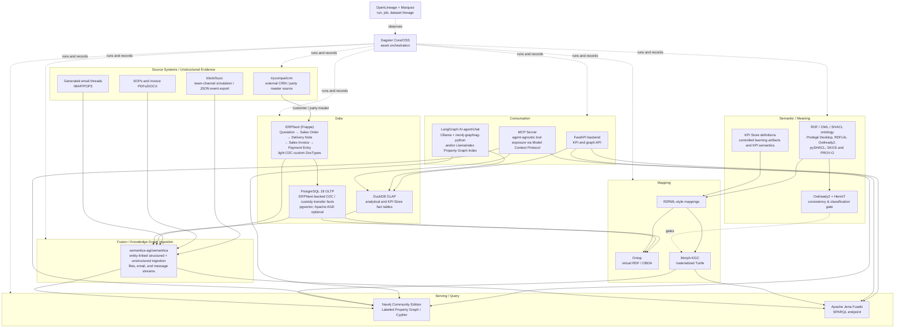

# Downstream O&G Knowledge Homelab — End-to-End Technical Reference Architecture

**Purpose:** Define the end-to-end reference architecture for a personal, open-source, single-machine learning environment that connects Downstream Oil & Gas facts, a governed meaning layer, graph serving, and a locally hosted AI agent.  
**Status:** Draft (personal homelab, not an EPM governed artifact)  
**Owner:** Hamid Adesokan  
**Last updated:** 2026-08-10  

## Architecture overview

The **Downstream O&G Knowledge Homelab** is a deliberately small, single-host architecture for learning the vertical trace from operational events to KPI answers. [ERPNext](https://github.com/frappe/erpnext) is the ERP/SAP-analog operational system of record for the O2C flow, backed by PostgreSQL 18, while [trycompai/crm](https://github.com/trycompai/crm) is an external CRM/Salesforce-analog source for customer and party master data. PostgreSQL holds the ERPNext-backed relational O2C and custody-transfer entities; DuckDB is the analytical system of record for derived volumes, pricing, margin facts, and KPI Store fact tables. PostgreSQL 18 is under the PostgreSQL License, while DuckDB is an embedded MIT-licensed analytical engine; their respective roles keep transactional and analytical facts in familiar SQL stores rather than making a graph database the authoritative fact store ([research compendium §11](../research_oss_tool_stack.md#11-open-source-operational-oltp-database-postgresql), [PostgreSQL 18 announcement](https://www.postgresql.org/about/news/postgresql-18-released-3142/), [research compendium §10](../research_oss_tool_stack.md#10-open-source-analytical-olap-databases-for-a-homelab), [DuckDB](https://duckdb.org/)).

RDF, OWL, and SHACL form the **meaning layer**: they express the business concepts, relationships, KPI definitions, glossary concepts, and provenance that make facts interpretable. Ontop exposes relational views virtually as RDF; Morph-KGC materializes only selected stable RDF assets, gated by an Owlready2/HermiT reasoning check (ADR-HL-019). Apache Jena Fuseki provides a SPARQL endpoint for persisted RDF. Neo4j Community Edition is a separate LPG serving/query layer, populated from curated RDF through neosemantics (n10s), not a competing system of record. FastAPI exposes application endpoints, and an MCP server exposes the same KPI/graph/SPARQL query surface to any MCP-compatible agent client, not only this homelab's own agent (ADR-HL-018). A LangGraph agent uses Ollama for local inference and `neo4j-graphrag-python` and/or LlamaIndex Property Graph Index for KG-grounded retrieval. Dagster owns asset execution, while OpenLineage and Marquez preserve pipeline lineage and make the flow observable ([research compendium §§1–3, 7, 9, 12](../research_oss_tool_stack.md)). This architecture borrows three patterns from AWS's Context Ontology Accelerator (COA), a GA open-source accelerator announced 2026-07-31 ([AWS announcement](https://aws.amazon.com/about-aws/whats-new/2026/07/aws-context--ontology-accelarator-generally-available/); [COA docs](https://aws.github.io/context-ontology-accelerator/)): the reasoning gate, the agent-agnostic MCP server, and the tiered resolution model described below — see `stack_decisions.md` for the full comparison and the patterns explicitly rejected as out of scope for a single-host homelab.

## Layered architecture diagram



Dagster Core is used as the Python-native, asset-based control plane; that model makes raw tables, transformations, RDF exports, validation reports, and graph loads explicit assets ([research compendium §9](../research_oss_tool_stack.md#9-open-source-orchestration-for-a-python-first-data-pipeline), [Dagster repository](https://github.com/dagster-io/dagster)). OpenLineage is the open lineage standard, and Marquez is its reference implementation for collecting and visualizing run, job, and dataset metadata ([research compendium §12](../research_oss_tool_stack.md#12-data-lineage--observability-openlineage--marquez), [OpenLineage](https://github.com/OpenLineage/OpenLineage), [Marquez](https://github.com/MarquezProject/marquez)).

## End-to-end data flow narrative

The following illustrates a single answerable fact, such as a synthetic gasoline custody-transfer ticket enriched with an EIA rack price.

1. **Ingest or generate operational evidence.** [ERPNext](https://github.com/frappe/erpnext) generates the Quotation → Sales Order → Delivery Note → Sales Invoice → Payment Entry flow and light custom Frappe DocTypes for Credit Limit Review, Collection Case, Dispute Case, and AR Sub-Ledger Close Task. [trycompai/crm](https://github.com/trycompai/crm) supplies external customer/party master data to Master Data Mgmt; the resulting O2C, terminal-lifting, bill-of-lading/ticket, observed/corrected-volume, price-basis, tax, and invoice records are stored in ERPNext-backed PostgreSQL tables with source timestamps. PostgreSQL remains authoritative for these transactional facts; `pgvector` is available for embeddings and Apache AGE is an explicitly optional experiment, neither replacing Neo4j’s serving role ([research compendium §11](../research_oss_tool_stack.md#11-open-source-operational-oltp-database-postgresql), [pgvector](https://github.com/pgvector/pgvector), [Apache AGE](https://age.apache.org/overview/)).

   [semantica-agi/semantica](https://github.com/semantica-agi/semantica) ingests an unstructured artifact such as an email about disputed `invoice_id` `INV-10042` alongside the corresponding ERPNext/PostgreSQL invoice row, resolving the shared invoice and dispute identifiers into the same knowledge-graph entity. The same entity-linked ingestion path covers SOP and invoice files plus structured JSON event-log exports from [block/buzz](https://github.com/block/buzz), preserving the contributing sources as provenance rather than creating disconnected document and relational corpora.

2. **Produce analytical facts.** A downstream Dagster asset reads the controlled operational extract, calculates analytical volumes and price/margin measures in DuckDB, and writes a DuckDB analytical table plus a KPI Store fact table. The fact row carries grain, period, dimensions, calculation version, source identifiers, and quality/status fields. A KPI definition is distinct from a raw calculation: this homelab records only its selected learning KPI definitions and does not treat a source calculation as automatically approved.

3. **Expose virtual meaning.** Ontop uses the ontology and R2RML-style mappings to expose PostgreSQL and DuckDB views as a virtual RDF graph. A SPARQL query can therefore resolve `CustodyTransferTicket`, `GasolineRackPrice`, `GasolineNetback`, its business terms, and its source identifiers without first duplicating every relational fact into triples. Ontop translates SPARQL to live SQL and, in the cited research, Ontop 5.5.0 is an Apache-2.0 virtual knowledge graph engine ([research compendium §3](../research_oss_tool_stack.md#3-relational-to-rdf-r2rmlrml-mapping-engines), [Ontop VKG guide](https://ontop-vkg.org/guide/)).

4. **Validate ontology consistency.** Before any release proceeds to materialization, a Dagster asset loads the current T-Box into Owlready2 and runs `sync_reasoner()` (HermiT, the Owlready2 default) to check logical consistency and reclassify individuals/classes. Materialization is blocked if the reasoner reports an inconsistency; inferred facts are written to a separate inference ontology rather than merged silently into the asserted T-Box. This pattern is borrowed from AWS Context Ontology Accelerator's ontology-engine reasoning step (ADR-HL-019; [Owlready2 reasoning docs](https://owlready2.readthedocs.io/en/v0.51/reasoning.html)).

5. **Materialize the stable semantic subset.** A separate Dagster asset invokes Morph-KGC for selected stable facts: terminal and product topology, KPI definitions, controlled glossary terms, mapping version, and provenance/lineage assertions. It writes Turtle files that are version-controlled in Git. Morph-KGC is the Apache-2.0 Python materialization engine for R2RML/RML-family mappings; materialization is intentional here because the output is a reviewable, portable graph artifact, not because the operational store ceased to be authoritative ([research compendium §3](../research_oss_tool_stack.md#3-relational-to-rdf-r2rmlrml-mapping-engines), [Morph-KGC documentation](https://morph-kgc.readthedocs.io/en/latest/why-morph-kgc/)).

6. **Serve RDF and graph queries.** The selected Turtle release is loaded into Apache Jena Fuseki for SPARQL exploration and imported into self-hosted Neo4j Community Edition through n10s. Fuseki is the baseline open-source SPARQL server; Jena 6.2.0 is the researched current release and requires Java 21 or newer ([research compendium §1](../research_oss_tool_stack.md#1-triple-stores--rdf-databases), [Apache Jena downloads](https://jena.apache.org/download/index.cgi)). n10s imports RDF vocabularies and validates SHACL on self-hosted Neo4j, not Neo4j Aura; the cited research identifies release 2025.06.1 as a June 2025 bugfix release ([research compendium §2](../research_oss_tool_stack.md#2-neo4j--rdf-integration), [Neo4j Labs n10s](https://neo4j.com/labs/neosemantics/)).

7. **Answer with an accountable path, through an explicit resolution tier.** Every question is answered by one of three named tiers (ADR-HL-020), and the response carries a resolution trace saying which tier answered it:
   - **Tier 0 — Governed metric.** The FastAPI backend or MCP server reads a pre-computed KPI Store fact-table value directly from DuckDB. Deterministic, 0 LLM calls.
   - **Tier 1 — Structured graph query.** A Cypher query against Neo4j, or a SPARQL query against Fuseki/Ontop, resolves the KPI's concepts, topology, definition, and semantic path when the answer is not a pre-computed KPI.
   - **Tier 2 — Agentic fallback.** The LangGraph agent chooses the permitted tools, asks Ollama to synthesize a response, and uses `neo4j-graphrag-python` and/or LlamaIndex Property Graph Index to retrieve graph-grounded context when Tiers 0–1 cannot resolve the question.

   The MCP server (built on the official `modelcontextprotocol/python-sdk`, ADR-HL-018) exposes this same three-tier resolution path as MCP tools, so any MCP-compatible agent client — not only this homelab's own LangGraph agent — can consume it. LangGraph is MIT-licensed, LlamaIndex Property Graph Index supports imported or LLM-built property graphs, and Ollama provides a local REST/OpenAI-compatible serving path ([research compendium §§7–8](../research_oss_tool_stack.md#7-ai-agent-frameworks-for-knowledge-graph-grounded-agents), [LangGraph license](https://github.com/langchain-ai/langgraph/blob/main/LICENSE), [LlamaIndex Property Graph Index](https://developers.llamaindex.ai/python/framework-api-reference/indices/property_graph/), [Ollama comparison coverage](https://dev.to/synsun/running-local-llms-in-2026-ollama-lm-studio-and-jan-compared-121c); [python-sdk](https://github.com/modelcontextprotocol/python-sdk)). The response includes the materialization and Dagster run identifiers obtained from OpenLineage/Marquez, so it can cite how the fact was produced rather than presenting an unsupported answer. This tiered-resolution-with-trace pattern is borrowed from AWS Context Ontology Accelerator's Serve stage ([COA docs](https://aws.github.io/context-ontology-accelerator/)).

## Component responsibility table

| Layer | Component/Tool | Responsibility | What it is NOT responsible for |
|---|---|---|---|
| Containerization | Docker Compose | Starts and networks the single-host services. | Cluster orchestration or production high availability. |
| CRM / Salesforce-analog source | [trycompai/crm](https://github.com/trycompai/crm) (MIT) | Supplies external customer/account/contact/party master data to Master Data Mgmt. | Acting as the ERP O2C transaction system or the mastered semantic layer. |
| ERP / SAP-analog system of record | [ERPNext](https://github.com/frappe/erpnext) (GPL-3.0) | Runs Quotation → Sales Order → Delivery Note → Sales Invoice → Payment Entry and light custom Frappe DocTypes for Credit Limit Review, Collection Case, Dispute Case, and AR Sub-Ledger Close Task. | Replacing the analytical KPI Store, RDF semantic authority, or graph serving layer. |
| OLTP | PostgreSQL 18 | System of record for synthetic O2C and custody-transfer facts. | RDF semantic authority or primary graph serving. |
| OLTP extension | pgvector | Stores/query embeddings when a Postgres-local vector path is useful. | Replacing KG-grounded graph retrieval. |
| OLTP extension (optional) | Apache AGE | Optional experiment in Cypher inside PostgreSQL. | The baseline Neo4j graph layer. |
| OLAP | DuckDB | System of record for analytical aggregates and KPI Store fact tables. | A network database service or operational ticket system. |
| Team-channel simulation | [block/buzz](https://github.com/block/buzz) (Apache-2.0) | Provides a self-hosted Nostr-relay workspace where scripted or agent-generated `buzz-cli` messages use the same O2C identifiers as relational data and export a structured JSON event log. | Being the operational system of record, message-of-record platform, or knowledge graph. |
| Unstructured + structured fusion / KG ingestion | [semantica-agi/semantica](https://github.com/semantica-agi/semantica) (MIT) | Ingests files, IMAP/POP3 email, message streams, and ERPNext/PostgreSQL relational data; entity-links shared IDs and loads the fused graph alongside the Ontop/Morph-KGC/Fuseki/Neo4j stack. | Replacing ERPNext/PostgreSQL transactional authority, Ontop virtual mappings, or the governed ontology. |
| Orchestration | Dagster Core/OSS | Defines, executes, schedules, and observes data/RDF/graph assets. | Being the data store or semantic model. |
| Ontology authoring | Protégé Desktop | Edits OWL/RDFS ontology and shapes. | Runtime API, mapping engine, or graph database. |
| RDF handling | RDFLib | Parses, serializes, and queries RDF in Python pipeline code. | Production graph serving. |
| OWL-as-objects | Owlready2 | Uses OWL classes/objects and reasoning where needed. | The canonical persistence layer for all facts. |
| Ontology reasoning gate | Owlready2 (HermiT via `sync_reasoner()`) | Checks OWL consistency and reclassifies individuals/classes before materialization proceeds (ADR-HL-019). | Validating instance-level shape constraints (that is pySHACL's job) or serving live queries. |
| RDF store backend (optional) | oxrdflib | Provides a PyOxigraph-backed RDFLib store when local performance needs it. | The required Fuseki endpoint. |
| SHACL | pySHACL | Validates RDF output against SHACL shapes in CI/pipeline runs. | Defining business ownership or remediating source data. |
| Virtual mapping | Ontop | Rewrites SPARQL to SQL over relational views without a copy. | Materializing every RDF statement. |
| Materialized mapping | Morph-KGC | Creates curated RDF/Turtle from R2RML/RML mappings. | Live SPARQL-to-SQL virtualization. |
| SPARQL serving | Apache Jena Fuseki | Hosts persisted RDF and a SPARQL endpoint. | Operational or KPI fact authority. |
| Embedded triple-store exploration (optional) | Oxigraph | Supports no-server/embedded RDF performance experiments. | Replacing the baseline Fuseki service. |
| LPG serving | Neo4j Community Edition | Serves curated graph paths through Cypher. | The source of truth for volumes or KPI facts. |
| RDF–LPG bridge | neosemantics (n10s) | Imports/exports RDF and supports SHACL-related graph integration. | Lossless preservation of all RDF/OWL semantics. |
| Agent orchestration | LangGraph | Controls stateful AI-agent and tool-routing flow. | LLM hosting or a graph store. |
| KG retrieval | neo4j-graphrag-python and/or LlamaIndex Property Graph Index | Retrieves Neo4j-grounded context for the agent. | Defining the ontology or owning KPI values. |
| Local LLM | Ollama | Serves a local selected Qwen3.6-27B, Qwen3.6-35B-A3B, or Mistral Small 3.2 24B model. | Data lineage, governance approval, or factual authority. |
| Backend | FastAPI | Exposes constrained KPI, graph, and chat endpoints. | Data transformation orchestration. |
| Agent-agnostic serving | MCP server (official `modelcontextprotocol/python-sdk`) | Exposes the KPI Store, Cypher, and SPARQL query surface as MCP tools to any MCP-compatible agent client (ADR-HL-018). | Replacing FastAPI, hosting business logic, or being reachable from the public internet. |
| Observability | OpenLineage + Marquez | Captures and visualizes job, run, input, and output lineage. | Replacing PROV-O semantic provenance. |
| Glossary standard | SKOS | Represents glossary/taxonomy concepts and labels. | Defining relational tables or executing queries. |
| Provenance standard | PROV-O | Expresses semantic entities, activities, agents, and derivations. | Replacing operational lineage events. |

The tool versions and licensing statements in this table are governed by the shared baseline and the [research compendium](../research_oss_tool_stack.md); RDFLib is BSD-3-Clause, Owlready2 LGPL v3, pySHACL Apache-2.0, and SKOS and PROV-O are W3C Recommendations ([research compendium §§4–6, 13](../research_oss_tool_stack.md#4-shacl-validation), [RDFLib](https://github.com/RDFLib/rdflib), [pySHACL](https://github.com/RDFLib/pyshacl), [W3C SKOS](https://www.w3.org/TR/skos-reference/), [W3C PROV-O](https://www.w3.org/TR/prov-o/)).

## The “virtual RDF first” decision explained

The default is **Ontop-based virtual RDF/OBDA**, not immediate triple-store materialization. The operational and analytical stores stay the systems of record for volumes and facts; the RDF/OWL layer supplies stable meaning over them. Virtual RDF avoids a second full fact copy, reduces synchronization logic, permits a SPARQL question to use current SQL-backed values, and makes mappings an explicit, inspectable translation boundary. Materialization remains appropriate for stable, curated semantic assets whose Git review, sharing, Neo4j import, or Fuseki hosting is useful. This is the shared “operational store stays source of truth” principle, not a claim that every query must be virtual ([stack decisions](stack_decisions.md#architecture-principle-carried-over-from-the-enterprise-epm-project), [research compendium §3](../research_oss_tool_stack.md#3-relational-to-rdf-r2rmlrml-mapping-engines)).

Illustrative pseudo-mapping:

```turtle
<#TicketMapping>
  rr:logicalTable [ rr:tableName "o2c.custody_transfer_ticket" ];
  rr:subjectMap [
    rr:template "https://homelab.example/ticket/{ticket_id}";
    rr:class og:CustodyTransferTicket
  ];
  rr:predicateObjectMap [
    rr:predicate og:netStandardVolumeBarrels;
    rr:objectMap [ rr:column "nsv_bbl" ]
  ] .
```

```sparql
PREFIX og: <https://homelab.example/ontology/>
SELECT ?ticket ?nsv
WHERE {
  ?ticket a og:CustodyTransferTicket ;
          og:netStandardVolumeBarrels ?nsv .
}
```

Ontop rewrites this kind of ontology-aligned question into SQL against the mapped relational view; the pseudo-mapping is illustrative, not a complete executable mapping.

## RDF-to-LPG (Neo4j) mapping approach

The pipeline imports selected materialized RDF through n10s using a documented import configuration. Map stable OWL classes to Neo4j labels, object properties to relationship types, and scalar data properties to node properties. Preserve an RDF URI identifier on every imported node so Cypher results remain traceable to RDF resources.

| RDF class/property | Neo4j representation | Example |
|---|---|---|
| `og:CustodyTransferTicket` | Node label | `(:CustodyTransferTicket {uri, ticketId, nsvBbl})` |
| `og:Terminal` | Node label | `(:Terminal {uri, terminalCode})` |
| `og:Product` | Node label | `(:Product {uri, productCode})` |
| `og:liftedAtTerminal` | Relationship type | `(:CustodyTransferTicket)-[:LIFTED_AT_TERMINAL]->(:Terminal)` |
| `og:forProduct` | Relationship type | `(:CustodyTransferTicket)-[:FOR_PRODUCT]->(:Product)` |
| `og:netStandardVolumeBarrels` | Node property | `ticket.nsvBbl` |

This is a translation, not a semantic identity. RDF is triple-based and open-world; Neo4j is a labeled-property-graph model generally used with closed-world application assumptions. As the research compendium explains, blank nodes, full reification, multi-valued predicates, and some OWL constructs can be lost or require explicit translation choices during n10s import ([research compendium §2](../research_oss_tool_stack.md#2-neo4j--rdf-integration), [Neo4j Labs n10s](https://neo4j.com/labs/neosemantics/)). Keep the RDF/Turtle release and ontology as the semantic reference; do not infer that every Cypher representation is a lossless OWL model.

## Deployment topology

Docker Compose runs the services on one trusted host. The proposed development bindings are deliberately local-only (`127.0.0.1`) unless a learning exercise requires a LAN client.

| Service | Typical host port(s) | Deployment note |
|---|---:|---|
| `postgres` | 5432 | PostgreSQL 18 with `pgvector`; Apache AGE remains optional. |
| `duckdb-is-embedded-no-service-needed` | none | DuckDB is opened by the Dagster/FastAPI Python processes, not deployed as a server ([research compendium §10](../research_oss_tool_stack.md#10-open-source-analytical-olap-databases-for-a-homelab)). |
| `fuseki` | 3030 | Hosts the materialized RDF dataset and SPARQL endpoint. |
| `neo4j` | 7474, 7687 | Browser/HTTP and Bolt for Cypher clients; n10s is installed in this self-hosted service. |
| `ollama` | 11434 | Hosts the selected local model. |
| `dagster-webserver` | 3000 | Dagster UI; the daemon/process runs the assets. |
| `marquez` | 5000, 5001 | UI/API bindings may be adjusted to the Compose image configuration. |
| `fastapi-backend` | 8000 | Exposes `/docs`, KPI, graph, and agent endpoints. |
| `mcp-server` | 8001 | Exposes the read-only KPI Store/Cypher/SPARQL tool surface over the Model Context Protocol (ADR-HL-018). |

For a useful starting point, allocate **4 CPU cores and 16 GB RAM** for the database, graph, pipeline, and UI services; **8 logical CPU cores and 32 GB RAM** makes simultaneous local development more comfortable. Local use of the selected 24B–35B-class Ollama models can require substantially more RAM and/or an appropriately sized GPU, so it should be started only when the personal host can support it. This is resource guidance for a personal learning machine, not sizing for concurrent users, production service levels, or a resilient cluster. Neo4j Community Edition is GPLv3 and n10s is a Neo4j Labs plugin limited to self-hosted installations, which aligns with this topology ([research compendium §2](../research_oss_tool_stack.md#2-neo4j--rdf-integration), [Neo4j Labs n10s](https://neo4j.com/labs/neosemantics/)).

## Non-functional considerations for a homelab (not production)

- **Backup and reproducibility.** Version ontology files, SHACL shapes, R2RML mappings, and curated Turtle releases in Git. Use `pg_dump` for PostgreSQL; retain DuckDB database files and selected input extracts. A restore drill should recreate a known data release, re-run the Dagster assets, and re-import Neo4j.
- **Security.** Bind services locally by default, use local credentials/secrets, and do not expose Neo4j, Fuseki, Marquez, Ollama, or the MCP server to the public internet. The point is safe personal experimentation, not internet-facing SaaS.
- **Intentional simplification.** There is one owner, one host, synthetic/public learning data, and no enterprise IAM, high availability, disaster-recovery site, formal data-classification workflow, or production SLO. The architecture teaches enterprise-relevant separation of systems of record, semantic meaning, serving, lineage, and consumption without claiming enterprise controls.

## Related homelab documents

- `00-Homelab-Charter-and-Roadmap.md`
- `02-Tool-Selection-and-ADRs.md`
- `03-Curriculum-and-Learning-Modules.md`
- `04-Data-Strategy-and-Datasets.md`
- `05-Domain-Model-and-Ontology-Pilot.md`
- `06-Repo-Structure-and-Build-Plan.md`

**See also (enterprise EPM parallel):** This document loosely mirrors the **System Integration Reference Architecture / KPI Store Technical Design** pattern for context and learning transfer only; it is not a governed EPM artifact or formal implementation design.
